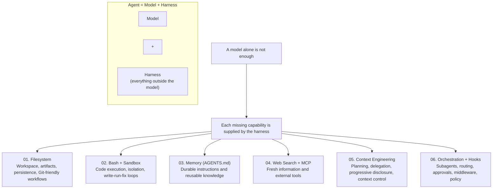

<h3 align="center">Examples</h3>

<p align="center">
  Agents, patterns, and applications you can build with Deep Agents.
</p>

## Harness Architecture

**Agent = Model + Harness**

The model provides intelligence. The harness makes that intelligence useful.

The point of the diagram is that model quality alone is not enough. A practical agent needs systems around the model so it can persist work, execute actions, access fresh information, manage context, and coordinate specialized behaviors.



### The Six Harness Components

1. **Filesystem**
   - Gives the agent a working directory for inputs, outputs, notes, and intermediate artifacts.
   - Makes progress durable across turns and runs.
   - Works well with Git for versioning, rollback, and collaboration.

2. **Bash + Sandbox**
   - Lets the agent execute commands and run code instead of only describing what should happen.
   - Sandboxing adds isolation, safety controls, and reproducibility.
   - Enables the core build loop: write -> run -> inspect -> fix.

3. **Memory (`AGENTS.md`)**
   - Stores durable instructions, policies, and reusable knowledge outside the model weights.
   - Keeps behavior consistent across runs.
   - Can be updated as the agent learns better workflows or constraints.

4. **Web Search + MCP**
   - Connects the agent to fresh information and external systems.
   - Web search handles current or missing knowledge.
   - MCP generalizes this idea so the agent can use external tools and services.

5. **Context Engineering**
   - Decides what the model sees, when it sees it, and what stays out of context.
   - Includes planning, skill loading, delegation, context resets/compression, and progressive disclosure.
   - Prevents context bloat/rot so the model can stay focused on the active task.

6. **Orchestration + Hooks**
   - Coordinates subagents, tools, routing, approvals, and runtime policies.
   - Hooks and middleware let you enforce behavior at execution time, not only in prompts.
   - This is what makes an agent dependable instead of just clever.

### How This Maps to the Examples Here

This repository is consistent with the diagram. Not every example uses all six components, but together the examples cover the full harness:

| Harness component | Where it shows up in this repo |
|---------|-------------|
| Filesystem | `content-builder-agent` and `text-to-sql-agent` both use `FilesystemBackend`; `ralph_mode` uses the filesystem as the agent's persistent worklog across fresh iterations. |
| Bash + Sandbox | `ralph_mode` supports remote sandboxes such as Modal, Daytona, AgentCore, and Runloop; `nvidia_deep_agent` executes code inside a Modal sandbox. |
| Memory (`AGENTS.md`) | `content-builder-agent`, `text-to-sql-agent`, `downloading_agents`, and `nvidia_deep_agent` all center memory files as persistent instructions. |
| Web Search + MCP | `deep_research`, `content-builder-agent`, and `nvidia_deep_agent` use web search tools; the research example README also explicitly notes that custom tools can be provided through MCP servers. |
| Context Engineering | `deep_research` uses planning, delegated subagents, and constrained research loops; `text-to-sql-agent` uses planning plus on-demand skills; `ralph_mode` demonstrates the "fresh context each loop" pattern. |
| Orchestration + Hooks | `deep_research` and `nvidia_deep_agent` orchestrate specialized subagents; `nvidia_deep_agent` also shows runtime routing through `context_schema` and includes commented `interrupt_on` hooks for human approval on tool execution. |

### A Practical Reading of the Diagram

In this repo, the model is the reasoning engine, while the harness is everything around it that turns reasoning into repeatable work:

- Files and backends let agents persist state and outputs.
- Skills and memory let agents load the right instructions at the right time.
- Tools, search, and MCP connect agents to the outside world.
- Subagents, runtime context, and approval hooks coordinate execution safely.

That is why these examples are better understood as **harness patterns for agents**, not just prompt examples.

| Example | Description |
|---------|-------------|
| [deep_research](deep_research/) | Multi-step web research agent using Tavily for URL discovery, parallel sub-agents, and strategic reflection |
| [content-builder-agent](content-builder-agent/) | Content writing agent that demonstrates memory (`AGENTS.md`), skills, and subagents for blog posts, LinkedIn posts, and tweets with generated images |
| [text-to-sql-agent](text-to-sql-agent/) | Natural language to SQL agent with planning, skill-based workflows, and the Chinook demo database |
| [ralph_mode](ralph_mode/) | Autonomous looping pattern that runs with fresh context each iteration, using the filesystem for persistence |
| [downloading_agents](downloading_agents/) | Shows how agents are just folders—download a zip, unzip, and run |

Each example has its own README with complete setup and usage instructions.

---

## 🚀 Quick Start

### Prerequisites

1. **Install uv package manager**:
   ```bash
   curl -LsSf https://astral.sh/uv/install.sh | sh
   ```

2. **Get API Keys**:
   - ✅ **[Tavily API Key](https://www.tavily.com/)** - For web search (generous free tier)
   - **Option A: Ollama** (LOCAL - FREE) - Install from https://ollama.ai
   - **Option B: Cloud APIs** - Anthropic, Google (optional)

3. **Setup Ollama** (Recommended for local execution):
   ```bash
   brew install ollama  # macOS
   ollama pull glm-4.7-flash:latest
   ollama pull qwen3.5:latest
   ollama serve
   ```

### Running the Demos

```bash
# Clone repository
git clone https://github.com/langchain-ai/deepagents.git
cd deepagents

# Set your keys (you have TAVILY_API_KEY)
export TAVILY_API_KEY=your_key_here
export OLLAMA_API_BASE=http://localhost:11434
export MODEL_NAME=glm-4.7-flash:latest

# Navigate to any demo and follow its README
cd deep_research
uv sync
# See the demo's README for next steps
```

### Demo Guides

For detailed setup instructions and usage examples, see each demo's README:

- 🔬 **[Deep Research Setup Guide →](deep_research/README.md)**
- ✍️ **[Content Builder Setup Guide →](content-builder-agent/README.md)**
- 💾 **[Text-to-SQL Setup Guide →](text-to-sql-agent/README.md)**
- 🔄 **[Ralph Mode Setup Guide →](ralph_mode/README.md)**
- 📦 **[Downloading Agents Setup Guide →](downloading_agents/README.md)**

---

## Contributing an Example

See the [Contributing Guide](https://docs.langchain.com/oss/python/contributing/overview) for general contribution guidelines.

When adding a new example:

- **Use uv** for dependency management with a `pyproject.toml` and `uv.lock` (commit the lock file)
- **Pin to deepagents version** — use a version range (e.g., `>=0.3.5,<0.4.0`) in dependencies
- **Include a README** with clear setup and usage instructions
- **Add tests** for reusable utilities or non-trivial helper logic
- **Keep it focused** — each example should demonstrate one use-case or workflow
- **Follow the structure** of existing examples (see `deep_research/` or `text-to-sql-agent/` as references)
