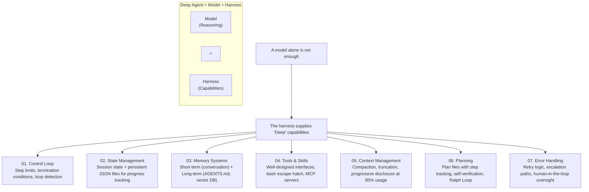

<h3 align="center">Harness Engineering Examples</h3>

<p align="center">
  Agents, patterns, and applications you can build with Deep Agents.
</p>

## What is DeepAgents?

**Deep Agents is an agent harness.** An opinionated, ready-to-run agent out of the box. Instead of wiring up prompts, tools, and context management yourself, you get a working agent immediately and customize what you need.

**What's included:**

- **Planning** — `write_todos` for task breakdown and progress tracking
- **Filesystem** — `read_file`, `write_file`, `edit_file`, `ls`, `glob`, `grep` for reading and writing context
- **Shell access** — `execute` for running commands (with sandboxing)
- **Sub-agents** — `task` for delegating work with isolated context windows
- **Smart defaults** — Prompts that teach the model how to use these tools effectively
- **Context management** — Auto-summarization when conversations get long, large outputs saved to files

This repository demonstrates various patterns and specialized agents built on top of the DeepAgents harness.

---

## Harness Architecture: The "Deep Agent" Pattern

**Deep Agent = Reasoning Model + Orchestration Harness**

While the model provides raw intelligence, the **Harness** is what makes that intelligence dependable for complex, long-running tasks. Deep Agents shift from simple "Chat" patterns to "Deep" patterns by baking structured planning, stateful memory, and resource management directly into the architecture.

### The Gap Between Demo and Production

Your agent just billed a user $38 on a single query. Not because it did something complex. Because it summarized the same document 47 times in a row. No crash. No alert. Just a spinning loop and a growing invoice.

You check the model logs. The model was working exactly as trained.

**The problem was that everything wrapped around it had no memory of what it already did, no state file, no stop condition.**

That is the gap between a demo and a production agent.

Building an agent that works once is genuinely easy. Call an LLM, give it tools, let it loop. Twenty lines of Python. You record a demo. It looks clean.

Then you ship it. Real users send unexpected inputs. A tool call returns empty. Context fills up after forty minutes. Two subagents contradict each other. The model decides to retry something indefinitely.

Everything invisible in the demo becomes a failure in production.

**The gap is not model quality. It is harness quality.**



### Agent = Model + Harness

This framing changes how you build:

```
Model    → reasoning, language, decisions
Harness  → everything the model needs to act reliably
```

A model without a harness is a brain without a nervous system. The thinking happens. Nothing else does.

If you're not the model, you're the harness. A harness is every line of code, every config, every execution hook that wraps the model and turns a text generator into something that actually does work.

Most engineers spend 90% of their time on the model: better prompts, newer models, more examples. **Production failures almost always live in the 10% they skipped.**

### The Seven Harness Pillars

#### 1. Control Loop
The heartbeat of the agent. Without it, you get one model call and one response. That's not an agent, it's a chatbot.

The loop runs the model, reads what it returned, executes any tool calls, feeds the results back in, and repeats until either the model stops calling tools or a step limit fires.

```python
while agent_is_running:
    response = call_model(context)
    
    if response.has_tool_calls:
        results = execute_tools(response.tool_calls)
        append_to_context(results)
        continue
    
    if response.is_final_answer:
        return response.content
    
    if step_count > MAX_STEPS:
        return "Task incomplete. Max steps reached."
```

The `MAX_STEPS` line is not optional. It is the difference between a well-behaved agent and the $38 incident. Build it in before you write a single tool.

#### 2. State Management
A model is stateless by default. Every API call starts fresh. Without the harness explicitly tracking what happened, the agent has no memory of what it already did, what succeeded, or where it left off.

You need two kinds of state:
- **Session state**: conversation history, tool results, current step number
- **Persistent state**: survives when the session ends (progress on long tasks, completed subtasks, files already processed)

The simplest production state store is a JSON file:

```json
{
  "task_id": "refactor-auth-module",
  "completed_files": ["auth.py", "middleware.py"],
  "pending_files": ["routes.py", "tests/test_auth.py"],
  "current_step": 3
}
```

For a coding agent working across a large codebase, this file is what separates an agent that makes progress from one that re-edits the same file every loop. Git adds versioning on top: agents can track work, roll back mistakes, and branch experiments.

#### 3. Memory
State tracks what the agent did this session. Memory is what it knows across sessions.

- **Short-term memory**: conversation history (every message, tool call, result appended to a list passed to the model)
- **Long-term memory**: survives across sessions (user preferences, project conventions, customer history)

A good production pattern:

```python
Session start:
  1. Load AGENTS.md or project memory file → inject into system prompt
  2. Retrieve relevant memories based on current task → add as context
During session:
  3. Maintain rolling conversation history
Session end:
  4. Summarize key learnings → write to memory store
```

An agent without long-term memory re-learns context on every run. Users notice. They start to feel like the agent is forgetting them even though the model is perfectly capable. That erosion of trust is a harness problem, not a model problem.

#### 4. Tools and the Bash Escape Hatch
Tools are what convert language into action. Without them, the model produces text about doing things. With them, it does them.

Tool design matters more than tool count. Every tool you add costs context (its description lives in the prompt) and increases the chance the model picks the wrong one. Three tools with excellent descriptions will outperform fifteen with vague ones.

A good tool description answers three questions:
- What does this tool actually do?
- When should I use it (not just when I can)?
- What does the output look like so I know it worked?

The bash escape hatch is the architectural move that changes what agents can do. Instead of pre-designing every possible tool, you give the agent access to bash and it writes its own tools on the fly. This is how Claude Code handles open-ended tasks.

The tradeoff is security, which is why sandbox isolation becomes non-negotiable the moment bash is in play.

#### 5. Context Management
Context rot is one of the sneakiest production failures there is.

The agent was running well for forty minutes. Now it is ignoring its own system prompt. Nothing crashed. No error fired. The context window filled up, the important instructions got buried in the middle, and the model gradually stopped attending to them.

Three patterns that actually work in production:

- **Compaction**: summarizes older conversation history rather than dropping it cold. Never compress the original task definition or system prompt.
- **Tool output truncation**: prevents large tool results from flooding context. Keep the first and last N tokens, store the full output to the filesystem, give the model a pointer if it needs more.
- **Skills via progressive disclosure**: loads tool descriptions on demand when the model decides it needs that capability. An agent with 50 skills loaded lazily often outperforms one with 10 tools loaded upfront.

The production rule: your system prompt and task definition stay visible always. Compress history before you touch those.

#### 6. Planning
A model without planning takes the most obvious next step, whether or not it is part of a coherent path to the goal.

The plan file pattern is the simplest fix that actually works in production:

```yaml
task: Migrate database schema from v1 to v2
steps:
  - Backup current schema         [ ]
  - Generate migration script     [ ]
  - Run migration on staging      [x]
  - Verify data integrity         [ ]
  - Run migration on production   [ ]
  - Update documentation          [ ]
current_step: 4
```

The harness injects this into context at the start of every loop. The agent checks off steps as it completes them. If the session ends, the plan persists. When the agent resumes, it knows exactly where it is.

Self-verification closes the loop. After completing each step, the agent verifies the result before moving on. The harness can enforce this by running a test suite and feeding back failures.

The Ralph Loop is worth knowing by name. When an agent finishes its context window on a long task without completing the goal, the Ralph Loop intercepts that exit via a hook, injects the original goal into a fresh context window, and forces continuation. The filesystem makes this possible: each fresh context reads state from the previous iteration. This is how true long-horizon autonomy works across multiple context windows.

#### 7. Error Handling
The real world does not cooperate. Tools fail. APIs rate-limit. Files are missing. Models occasionally return output that does not parse.

Without explicit error handling, an agent that hits any of these situations has two bad options: crash, or silently hallucinate around the error as if it did not happen. Both are production failures.

```python
Tool fails:
   Retryable? (timeout, rate limit) → exponential backoff
   Data error? → try alternative approach
   Permissions error? → escalate to human

Model output malformed:
   Retry with explicit format reminder
   Three failures → fall back to structured output enforcement

Agent looping:
   Step counter fires → force stop
   Repeated identical tool calls detected → interrupt and redirect

Confidence low:
   Flag for async human review
   Do not block the user while waiting
```

The escalation path is the most important part. Humans on the loop, not in the loop.

### How This Maps to the Examples Here

This repository is consistent with the diagram. Not every example uses all six components, but together the examples cover the full harness:

| Deep Agent Pillar | Where it shows up in this repo |
|---------|-------------|
| **Virtual Filesystem** | `content-builder-agent` and `text-to-sql-agent` both use `FilesystemBackend` to persist artifacts; `ralph_mode` uses the filesystem as the agent's persistent worklog across iterations. |
| **Structured Planning** | `deep_research` and `text-to-sql-agent` use `write_todos` to maintain stateful plans; `ralph_mode` demonstrates the "fresh context each loop" planning pattern. |
| **Specialized Subagents** | `deep_research` and `nvidia_deep_agent` orchestrate specialized subagents via the `task` tool for parallel URL discovery and analysis. |
| **Durable Memory** | `content-builder-agent`, `text-to-sql-agent`, `downloading_agents`, and `nvidia_deep_agent` all center memory files (`AGENTS.md`) as persistent instructions. |
| **Context Engineering** | `deep_research` uses planning and constrained research loops; `text-to-sql-agent` uses on-demand skill loading; all examples benefit from automatic context compression. |
| **Secure Execution** | `ralph_mode` supports remote sandboxes like Modal, Daytona, and Runloop; `nvidia_deep_agent` executes code inside a Modal sandbox. |

### A Practical Reading of the Diagram

In this repo, the model is the reasoning engine, while the harness is everything around it that turns reasoning into repeatable work:

- Files and backends let agents persist state and outputs.
- Skills and memory let agents load the right instructions at the right time.
- Tools, search, and MCP connect agents to the outside world.
- Subagents, runtime context, and approval hooks coordinate execution safely.

That is why these examples are better understood as **harness patterns for agents**, not just prompt examples.

| Example | Description |
|---------|-------------|
| [deep_research](deep_research/) | Multi-step web research agent using Tavily for URL discovery, parallel sub-agents, and strategic reflection |
| [content-builder-agent](content-builder-agent/) | Content writing agent that demonstrates memory (`AGENTS.md`), skills, and subagents for blog posts, LinkedIn posts, and tweets with generated images |
| [text-to-sql-agent](text-to-sql-agent/) | Natural language to SQL agent with planning, skill-based workflows, and the Chinook demo database |
| [deploy-coding-agent](deploy-coding-agent/) | `deepagents deploy` example: autonomous coding agent with a LangSmith sandbox for code execution |
| [deploy-content-writer](deploy-content-writer/) | `deepagents deploy` example: content writing agent with skills for blog posts and social media |
| [deploy-mcp-docs-agent](deploy-mcp-docs-agent/) | `deepagents deploy` example: docs research agent that uses MCP tools to search LangChain documentation |
| [async-subagent-server](async-subagent-server/) | Self-hosted Agent Protocol server exposing a Deep Agents researcher as an async subagent, with a supervisor REPL |
| [nvidia_deep_agent](nvidia_deep_agent/) | Multi-model agent with NVIDIA Nemotron Super for research and GPU-accelerated code execution via RAPIDS |
| [ralph_mode](ralph_mode/) | Autonomous looping pattern that runs with fresh context each iteration, using the filesystem for persistence |
| [downloading_agents](downloading_agents/) | Shows how agents are just folders—download a zip, unzip, and run |
| [better-harness](better-harness/) | Eval-driven outer-loop optimization of a Deep Agents harness using the `better-harness` research artifact |

Each example has its own README with complete setup and usage instructions.

---

## 🚀 Quick Start

### Prerequisites

1. **Install uv package manager**:
   ```bash
   curl -LsSf https://astral.sh/uv/install.sh | sh
   ```

2. **Get API Keys**:
   - ✅ **[Tavily API Key](https://www.tavily.com/)** - For web search (generous free tier)
   - **Option A: Ollama** (LOCAL - FREE) - Install from https://ollama.ai
   - **Option B: Cloud APIs** - Anthropic, Google (optional)

3. **Setup Ollama** (Recommended for local execution):
   ```bash
   brew install ollama  # macOS
   ollama pull glm-4.7-flash:latest
   ollama pull qwen3.5:latest
   ollama serve
   ```

### Running the Demos

```bash
# Clone repository
git clone https://github.com/langchain-ai/deepagents.git
cd deepagents

# Set your keys (you have TAVILY_API_KEY)
export TAVILY_API_KEY=your_key_here
export OLLAMA_API_BASE=http://localhost:11434
export MODEL_NAME=glm-4.7-flash:latest

# Navigate to any demo and follow its README
cd deep_research
uv sync
# See the demo's README for next steps
```

### Demo Guides

For detailed setup instructions and usage examples, see each demo's README:

- 🔬 **[Deep Research Setup Guide →](deep_research/README.md)**
- ✍️ **[Content Builder Setup Guide →](content-builder-agent/README.md)**
- 💾 **[Text-to-SQL Setup Guide →](text-to-sql-agent/README.md)**
- 🔄 **[Ralph Mode Setup Guide →](ralph_mode/README.md)**
- 📦 **[Downloading Agents Setup Guide →](downloading_agents/README.md)**

---

## Resources

- **[Harness Engineering: Building Production-Grade AI Systems Beyond Prompts and Context](https://medium.com/@jerry.shao/harness-engineering-building-production-grade-ai-systems-beyond-prompts-and-context-5fcdffdd6b4c)** - A comprehensive guide on architecting robust AI systems with proper harness patterns

---

## Contributing an Example

See the [Contributing Guide](https://docs.langchain.com/oss/python/contributing/overview) for general contribution guidelines.

When adding a new example:

- **Use uv** for dependency management with a `pyproject.toml` and `uv.lock` (commit the lock file)
- **Pin to deepagents version** — use a version range (e.g., `>=0.3.5,<0.4.0`) in dependencies
- **Include a README** with clear setup and usage instructions
- **Add tests** for reusable utilities or non-trivial helper logic
- **Keep it focused** — each example should demonstrate one use-case or workflow
- **Follow the structure** of existing examples (see `deep_research/` or `text-to-sql-agent/` as references)
