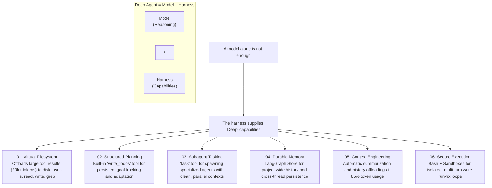

<h3 align="center">Examples</h3>

<p align="center">
  Agents, patterns, and applications you can build with Deep Agents.
</p>

## Harness Architecture: The "Deep Agent" Pattern

**Deep Agent = Reasoning Model + Orchestration Harness**

While the model provides raw intelligence, the **Harness** is what makes that intelligence dependable for complex, long-running tasks. Deep Agents shift from simple "Chat" patterns to "Deep" patterns by baking structured planning, stateful memory, and resource management directly into the architecture.



### The Six Harness Pillars

1. **Virtual Filesystem (Scalable Context)**
   - Prevents context window rot by offloading large data (logs, docs, artifacts) to a workspace.
   - Agents see truncated previews and use `read_file` or `grep` to fetch specific details on-demand.
   - Makes progress durable across turns and runs.

2. **Structured Planning (`write_todos`)**
   - Moves planning from "hidden reasoning" to "explicit state".
   - Agents maintain a persistent To-Do list to track multi-stage objectives.
   - Allows the agent to resume, pivot, and report progress reliably over long sessions.

3. **Specialized Subagents (Task Tool)**
   - The `task` tool spawns ephemeral subagents for isolated context-heavy work.
   - Enables **Parallelism**: Multiple subtasks can run concurrently without cluttering the main agent's history.
   - Prevents the "main thread" from becoming overloaded with irrelevant sub-task details.

4. **Durable Memory (`AGENTS.md` & Store)**
   - Combines file-based memory (Git-friendly) with a structured **LangGraph Store**.
   - Persists project-specific quirks, user preferences, and learned workflows across different conversational threads.

5. **Context Engineering (Automatic Compression)**
   - Actively manages the model's focus.
   - When context hits 85%, the system automatically summarizes the history and archives old messages to the filesystem.
   - Ensures agents can run indefinitely without hitting hard token limits or losing critical context.

6. **Secure Orchestration + Hooks**
   - Coordinates tools, routing, and approvals via middleware and runtime hooks.
   - Provides isolation through Bash sandboxes (Modal, Daytona, Runloop) for safe code execution.
   - Enforces business logic and safety policies at the execution layer, not just through prompting.

### How This Maps to the Examples Here

This repository is consistent with the diagram. Not every example uses all six components, but together the examples cover the full harness:

| Deep Agent Pillar | Where it shows up in this repo |
|---------|-------------|
| **Virtual Filesystem** | `content-builder-agent` and `text-to-sql-agent` both use `FilesystemBackend` to persist artifacts; `ralph_mode` uses the filesystem as the agent's persistent worklog across iterations. |
| **Structured Planning** | `deep_research` and `text-to-sql-agent` use `write_todos` to maintain stateful plans; `ralph_mode` demonstrates the "fresh context each loop" planning pattern. |
| **Specialized Subagents** | `deep_research` and `nvidia_deep_agent` orchestrate specialized subagents via the `task` tool for parallel URL discovery and analysis. |
| **Durable Memory** | `content-builder-agent`, `text-to-sql-agent`, `downloading_agents`, and `nvidia_deep_agent` all center memory files (`AGENTS.md`) as persistent instructions. |
| **Context Engineering** | `deep_research` uses planning and constrained research loops; `text-to-sql-agent` uses on-demand skill loading; all examples benefit from automatic context compression. |
| **Secure Execution** | `ralph_mode` supports remote sandboxes like Modal, Daytona, and Runloop; `nvidia_deep_agent` executes code inside a Modal sandbox. |

### A Practical Reading of the Diagram

In this repo, the model is the reasoning engine, while the harness is everything around it that turns reasoning into repeatable work:

- Files and backends let agents persist state and outputs.
- Skills and memory let agents load the right instructions at the right time.
- Tools, search, and MCP connect agents to the outside world.
- Subagents, runtime context, and approval hooks coordinate execution safely.

That is why these examples are better understood as **harness patterns for agents**, not just prompt examples.

| Example | Description |
|---------|-------------|
| [deep_research](deep_research/) | Multi-step web research agent using Tavily for URL discovery, parallel sub-agents, and strategic reflection |
| [content-builder-agent](content-builder-agent/) | Content writing agent that demonstrates memory (`AGENTS.md`), skills, and subagents for blog posts, LinkedIn posts, and tweets with generated images |
| [text-to-sql-agent](text-to-sql-agent/) | Natural language to SQL agent with planning, skill-based workflows, and the Chinook demo database |
| [deploy-coding-agent](deploy-coding-agent/) | `deepagents deploy` example: autonomous coding agent with a LangSmith sandbox for code execution |
| [deploy-content-writer](deploy-content-writer/) | `deepagents deploy` example: content writing agent with skills for blog posts and social media |
| [deploy-mcp-docs-agent](deploy-mcp-docs-agent/) | `deepagents deploy` example: docs research agent that uses MCP tools to search LangChain documentation |
| [async-subagent-server](async-subagent-server/) | Self-hosted Agent Protocol server exposing a Deep Agents researcher as an async subagent, with a supervisor REPL |
| [nvidia_deep_agent](nvidia_deep_agent/) | Multi-model agent with NVIDIA Nemotron Super for research and GPU-accelerated code execution via RAPIDS |
| [ralph_mode](ralph_mode/) | Autonomous looping pattern that runs with fresh context each iteration, using the filesystem for persistence |
| [downloading_agents](downloading_agents/) | Shows how agents are just folders—download a zip, unzip, and run |
| [better-harness](better-harness/) | Eval-driven outer-loop optimization of a Deep Agents harness using the `better-harness` research artifact |

Each example has its own README with complete setup and usage instructions.

---

## 🚀 Quick Start

### Prerequisites

1. **Install uv package manager**:
   ```bash
   curl -LsSf https://astral.sh/uv/install.sh | sh
   ```

2. **Get API Keys**:
   - ✅ **[Tavily API Key](https://www.tavily.com/)** - For web search (generous free tier)
   - **Option A: Ollama** (LOCAL - FREE) - Install from https://ollama.ai
   - **Option B: Cloud APIs** - Anthropic, Google (optional)

3. **Setup Ollama** (Recommended for local execution):
   ```bash
   brew install ollama  # macOS
   ollama pull glm-4.7-flash:latest
   ollama pull qwen3.5:latest
   ollama serve
   ```

### Running the Demos

```bash
# Clone repository
git clone https://github.com/langchain-ai/deepagents.git
cd deepagents

# Set your keys (you have TAVILY_API_KEY)
export TAVILY_API_KEY=your_key_here
export OLLAMA_API_BASE=http://localhost:11434
export MODEL_NAME=glm-4.7-flash:latest

# Navigate to any demo and follow its README
cd deep_research
uv sync
# See the demo's README for next steps
```

### Demo Guides

For detailed setup instructions and usage examples, see each demo's README:

- 🔬 **[Deep Research Setup Guide →](deep_research/README.md)**
- ✍️ **[Content Builder Setup Guide →](content-builder-agent/README.md)**
- 💾 **[Text-to-SQL Setup Guide →](text-to-sql-agent/README.md)**
- 🔄 **[Ralph Mode Setup Guide →](ralph_mode/README.md)**
- 📦 **[Downloading Agents Setup Guide →](downloading_agents/README.md)**

---

## Resources

- **[Harness Engineering: Building Production-Grade AI Systems Beyond Prompts and Context](https://medium.com/@jerry.shao/harness-engineering-building-production-grade-ai-systems-beyond-prompts-and-context-5fcdffdd6b4c)** - A comprehensive guide on architecting robust AI systems with proper harness patterns

---

## Contributing an Example

See the [Contributing Guide](https://docs.langchain.com/oss/python/contributing/overview) for general contribution guidelines.

When adding a new example:

- **Use uv** for dependency management with a `pyproject.toml` and `uv.lock` (commit the lock file)
- **Pin to deepagents version** — use a version range (e.g., `>=0.3.5,<0.4.0`) in dependencies
- **Include a README** with clear setup and usage instructions
- **Add tests** for reusable utilities or non-trivial helper logic
- **Keep it focused** — each example should demonstrate one use-case or workflow
- **Follow the structure** of existing examples (see `deep_research/` or `text-to-sql-agent/` as references)
