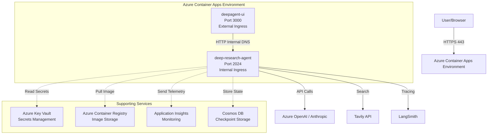

# Azure Container Apps Deployment Guide for Deep Research Agent

This guide provides step-by-step instructions for deploying the Deep Research Agent to Azure Container Apps and configuring container-to-container communication with the deepagent-ui.

## 📋 Table of Contents

- [Architecture Overview](#architecture-overview)
- [Prerequisites](#prerequisites)
- [Quick Start](#quick-start)
- [Detailed Deployment Steps](#detailed-deployment-steps)
- [Container-to-Container Communication](#container-to-container-communication)
- [Configuration Management](#configuration-management)
- [Monitoring & Observability](#monitoring--observability)
- [Scaling & Performance](#scaling--performance)
- [Security Best Practices](#security-best-practices)
- [Troubleshooting](#troubleshooting)
- [Cost Optimization](#cost-optimization)

---

## Architecture Overview

### Deployment Architecture



### Key Components

1. **deep-research-agent**: LangGraph server running on port 2024 (internal only)
2. **deepagent-ui**: React/Next.js frontend on port 3000 (external access)
3. **Azure Container Apps Environment**: Managed Kubernetes-like environment
4. **Internal DNS**: Enables secure container-to-container communication
5. **Azure Key Vault**: Secure secret management
6. **Application Insights**: Monitoring and telemetry

---

## Prerequisites

### Required Tools

```bash
# Install Azure CLI
curl -sL https://aka.ms/InstallAzureCLIDeb | sudo bash

# Install Docker
# macOS: Download from https://docs.docker.com/desktop/install/mac-install/
# Linux: curl -fsSL https://get.docker.com | sh
# Windows with npm: npm install -g docker

# Verify installations
az --version
docker --version
```

### Azure Subscription Requirements

- Active Azure subscription with permissions to create:
  - Resource Groups
  - Container Apps Environments
  - Container Registries
  - Key Vaults
  - Application Insights
  - (Optional) Cosmos DB accounts

### Local Configuration

```bash
# Login to Azure
$env:REQUESTS_CA_BUNDLE="C:\path\to\your\cert.pem"
az login

# Set your subscription
az account set --subscription 9d831a41-d092-4625-8861-89341d476f2d

# Create resource group
export RESOURCE_GROUP="rg-deep-agents"
export LOCATION="canadacentral"

az group create \
  --name $RESOURCE_GROUP \
  --location $LOCATION
```

---

## Quick Start

For a rapid deployment, use these commands:

```bash
cd deepagents-demo/deep_research

# 1. Build and push Docker image
export ACR_NAME="acrdeepagents"
az acr create --resource-group $RESOURCE_GROUP --name $ACR_NAME --sku Basic --admin-enabled true
az acr login -n $ACR_NAME --expose-token
az acr login --name $ACR_NAME

docker build --platform linux/amd64 -t $ACR_NAME.azurecr.io/deep-research-agent:latest .
docker push $ACR_NAME.azurecr.io/deep-research-agent:latest

# 2. Create Container Apps environment
export ENV_NAME="env-deep-agents"
az containerapp env create \
  --name $ENV_NAME \
  --resource-group $RESOURCE_GROUP \
  --location $LOCATION

# 3. Deploy agent
export AGENT_NAME="deep-research-agent"
export ACR_USERNAME=$(az acr credential show --name $ACR_NAME --query username -o tsv)
export ACR_PASSWORD=$(az acr credential show --name $ACR_NAME --query 'passwords[0].value' -o tsv)

az containerapp create \
  --name $AGENT_NAME \
  --resource-group $RESOURCE_GROUP \
  --environment $ENV_NAME \
  --image $ACR_NAME.azurecr.io/deep-research-agent:latest \
  --registry-server $ACR_NAME.azurecr.io \
  --registry-username $ACR_USERNAME \
  --registry-password $ACR_PASSWORD \
  --target-port 2024 \
  --ingress internal \
  --min-replicas 1 \
  --max-replicas 3 \
  --cpu 2.0 \
  --memory 4Gi \
  --env-vars \
    ANTHROPIC_API_KEY=<your-key> \
    TAVILY_API_KEY=<your-key> \
    LANGCHAIN_TRACING_V2=true \
    LANGSMITH_ENDPOINT=https://api.smith.langchain.com \
    LANGCHAIN_API_KEY=<your-key> \
    LANGCHAIN_PROJECT=deep-research-production \
    ENABLE_EVAL_TRACKING=true \
    EVAL_HISTORY_FILE=./output/eval_history/server_runs.jsonl \
    MODEL_TPM=120000 \
    MODEL_RPM=500 \
    GRAPH_RECURSION_LIMIT=200 \
    MAX_CONCURRENT_RESEARCH_UNITS=3 \
    MAX_RESEARCHER_ITERATIONS=3

# 4. Get internal URL
INTERNAL_URL=$(az containerapp show \
  --name $AGENT_NAME \
  --resource-group $RESOURCE_GROUP \
  --query properties.configuration.ingress.fqdn \
  -o tsv)

echo "Agent Internal URL: https://$INTERNAL_URL"
echo "Test: curl https://$INTERNAL_URL/research/invoke"
```

---

## Detailed Deployment Steps

### Step 1: Prepare Docker Image

#### Review Existing Dockerfile

The project includes a production-ready `Dockerfile` based on `langchain/langgraph-api:3.11`:

```dockerfile
FROM langchain/langgraph-api:3.11

# Add local package
ADD . /deps/deep_research

# Install dependencies
RUN for dep in /deps/*; do \
      echo "Installing $dep"; \
      if [ -d "$dep" ]; then \
        (cd "$dep" && PYTHONDONTWRITEBYTECODE=1 uv pip install \
          --system --no-cache-dir -c /api/constraints.txt -e .); \
      fi; \
    done

# Configure LangGraph graphs
ENV LANGSERVE_GRAPHS='{"research": "/deps/deep_research/agent.py:agent"}'

# Ensure langgraph-api is preserved
RUN mkdir -p /api/langgraph_api /api/langgraph_runtime /api/langgraph_license && \
    touch /api/langgraph_api/__init__.py /api/langgraph_runtime/__init__.py \
          /api/langgraph_license/__init__.py
RUN PYTHONDONTWRITEBYTECODE=1 uv pip install --system --no-cache-dir \
    --no-deps -e /api

# Clean up build dependencies
RUN pip uninstall -y pip setuptools wheel && \
    rm -rf /usr/local/lib/python*/site-packages/pip* \
           /usr/local/lib/python*/site-packages/setuptools* \
           /usr/local/lib/python*/site-packages/wheel* && \
    find /usr/local/bin -name "pip*" -delete || true

WORKDIR /deps/deep_research
```

#### Build and Push to Azure Container Registry

```bash
# Create Container Registry
export ACR_NAME="acrdeepagents$(openssl rand -hex 4)"
az acr create \
  --resource-group $RESOURCE_GROUP \
  --name $ACR_NAME \
  --sku Standard \
  --admin-enabled true

# Login to ACR
az acr login --name $ACR_NAME

# Build image (from deep_research directory)
cd deepagents-demo/deep_research
docker build --platform linux/amd64 -t $ACR_NAME.azurecr.io/deep-research-agent:latest .

# Push image
docker push $ACR_NAME.azurecr.io/deep-research-agent:latest

# Verify image
az acr repository list --name $ACR_NAME --output table
az acr repository show-tags --name $ACR_NAME --repository deep-research-agent --output table
```

### Step 2: Create Container Apps Environment

```bash
# Create environment with workload profiles (recommended for production)
export ENV_NAME="env-deep-agents"
az containerapp env create \
  --name $ENV_NAME \
  --resource-group $RESOURCE_GROUP \
  --location $LOCATION \
  --logs-workspace-id $(az monitor log-analytics workspace create \
    --resource-group $RESOURCE_GROUP \
    --workspace-name la-deep-agents \
    --query customerId -o tsv \
    --only-show-errors) \
  --logs-workspace-key $(az monitor log-analytics workspace get-shared-keys \
    --resource-group $RESOURCE_GROUP \
    --workspace-name la-deep-agents \
    --query primarySharedKey -o tsv)

# Enable Application Insights integration
az monitor app-insights component create \
  --app ai-deep-agents \
  --location $LOCATION \
  --resource-group $RESOURCE_GROUP \
  --kind web

az containerapp env telemetry application-insights set \
  --name $ENV_NAME \
  --resource-group $RESOURCE_GROUP \
  --instrumentation-key $(az monitor app-insights component show \
    --app ai-deep-agents \
    --resource-group $RESOURCE_GROUP \
    --query instrumentationKey -o tsv)
    
# az containerapp update \
#  --name "$APP_NAME" \
#  --resource-group "$RESOURCE_GROUP" \
#  --set properties.template.metadata.annotations.'containerapps.azure.com/monitoring'='{"application-insights": {"connection-string": "'$(az monitor app-insights component show --app ai-deep-agents --resource-group "$RESOURCE_GROUP" --query connectionString -o tsv)'"}}'
```

### Step 3: Configure Secrets in Azure Key Vault

```bash
# Create Key Vault
export KV_NAME="kv-deep-agents-$(openssl rand -hex 3)"
az keyvault create \
  --name $KV_NAME \
  --resource-group $RESOURCE_GROUP \
  --location $LOCATION \
  --enable-rbac-authorization false

# Store secrets
az keyvault secret set --vault-name $KV_NAME --name ANTHROPIC-API-KEY --value "<your-anthropic-key>"
az keyvault secret set --vault-name $KV_NAME --name TAVILY-API-KEY --value "<your-tavily-key>"
az keyvault secret set --vault-name $KV_NAME --name LANGCHAIN-API-KEY --value "<your-langsmith-key>"
az keyvault secret set --vault-name $KV_NAME --name AZURE-OPENAI-ENDPOINT --value "<your-azure-endpoint>"
az keyvault secret set --vault-name $KV_NAME --name AZURE-OPENAI-DEPLOYMENT --value "<your-deployment>"
az keyvault secret set --vault-name $KV_NAME --name AZURE-OPENAI-API-KEY --value "<your-azure-key>"

# Grant Container Apps permission to read secrets
az role assignment create \
  --assignee $(az identity show \
    --resource-group $RESOURCE_GROUP \
    --name "${ENV_NAME}-identity" \
    --query principalId -o tsv 2>/dev/null || echo "skip") \
  --role "Key Vault Secrets User" \
  --scope $(az keyvault show --name $KV_NAME --query id -o tsv)
```

### Step 4: Deploy Deep Research Agent

```bash
export AGENT_NAME="deep-research-agent"

az containerapp create \
  --name $AGENT_NAME \
  --resource-group $RESOURCE_GROUP \
  --environment $ENV_NAME \
  --image $ACR_NAME.azurecr.io/deep-research-agent:latest \
  --registry-server $ACR_NAME.azurecr.io \
  --registry-username $ACR_USERNAME \
  --registry-password $ACR_PASSWORD \
  --target-port 2024 \
  --ingress internal \
  --transport auto \
  --min-replicas 1 \
  --max-replicas 5 \
  --cpu 2.0 \
  --memory 4Gi \
  --env-vars \
    VERIFY_SSL=false \
    LOG_LEVEL=INFO \
    LANGCHAIN_TRACING_V2=true \
    LANGSMITH_ENDPOINT=https://api.smith.langchain.com \
    LANGCHAIN_PROJECT=deep-research-production \
    ENABLE_EVAL_TRACKING=true \
    EVAL_HISTORY_FILE=./output/eval_history/server_runs.jsonl \
    MODEL_TPM=120000 \
    MODEL_RPM=500 \
    GRAPH_RECURSION_LIMIT=200 \
    MAX_CONCURRENT_RESEARCH_UNITS=3 \
    MAX_RESEARCHER_ITERATIONS=3 \
    MAX_GLOB_DEPTH=3 \
    REPORTS_OUTPUT_FOLDER=./output \
    MAX_FILES_TO_READ=20 \
    MAX_TOTAL_SIZE_MB=50 \
    MODEL_MAX_RETRIES=5 \
    MODEL_INITIAL_BACKOFF=1.0 \
    MODEL_MAX_BACKOFF=60.0 \
    MODEL_BACKOFF_MULTIPLIER=2.0 \
    MODEL_RETRY_JITTER=true \
    UPLOAD_API_KEY=secretref:upload-api-key \
    TAVILY_API_KEY=secretref:tavily-api-key \
    LANGCHAIN_API_KEY=secretref:langchain-api-key \
    AZURE_OPENAI_ENDPOINT=secretref:azure-openai-endpoint \
    AZURE_OPENAI_DEPLOYMENT=secretref:azure-openai-deployment \
    AZURE_OPENAI_API_KEY=secretref:azure-openai-api-key \
  --system-assigned \
  --secrets \
    upload-api-key=keyvaultref:https://$KV_NAME.vault.azure.net/secrets/UPLOAD-API-KEY,identityref:system \
    tavily-api-key=keyvaultref:https://$KV_NAME.vault.azure.net/secrets/TAVILY-API-KEY,identityref:system \
    langchain-api-key=keyvaultref:https://$KV_NAME.vault.azure.net/secrets/LANGCHAIN-API-KEY,identityref:system \
    azure-openai-endpoint=keyvaultref:https://$KV_NAME.vault.azure.net/secrets/AZURE-OPENAI-ENDPOINT,identityref:system \
    azure-openai-deployment=keyvaultref:https://$KV_NAME.vault.azure.net/secrets/AZURE-OPENAI-DEPLOYMENT,identityref:system \
    azure-openai-api-key=keyvaultref:https://$KV_NAME.vault.azure.net/secrets/AZURE-OPENAI-API-KEY,identityref:system
```

**Important Notes:**
- `--target-port 2024`: Matches the default LangGraph dev server port
- `--ingress internal`: Only accessible within the Container Apps environment
- `--transport auto`: Automatically detects HTTP/1 or HTTP/2
- Secrets are referenced from Key Vault using `keyvaultref:` syntax

### Step 5: Verify Deployment

```bash
# Get agent details
az containerapp show \
  --name $AGENT_NAME \
  --resource-group $RESOURCE_GROUP \
  --query "{Name: name, FQDN: properties.configuration.ingress.fqdn, Status: properties.provisioningState}"

# Test connectivity (from within Azure network or using kubectl exec)
INTERNAL_FQDN=$(az containerapp show \
  --name $AGENT_NAME \
  --resource-group $RESOURCE_GROUP \
  --query properties.configuration.ingress.fqdn \
  -o tsv)

# Execute test command inside container
az containerapp exec \
  --name $AGENT_NAME \
  --resource-group $RESOURCE_GROUP \
  --command "curl -s http://localhost:2024/docs | head -20"

# Check logs
az containerapp logs show \
  --name $AGENT_NAME \
  --resource-group $RESOURCE_GROUP \
  --follow
```

---

## Container-to-Container Communication

### Architecture for UI + Agent

To enable `deepagent-ui` to communicate with `deep-research-agent`, deploy both in the same Container Apps environment with internal networking.

### Option 1: Internal Ingress (Recommended)

```bash
# Deploy deepagent-ui (assuming you have built the UI image)
export UI_NAME="deepagent-ui"
export UI_IMAGE="$ACR_NAME.azurecr.io/deepagent-ui:latest"

# First, get the agent's internal FQDN
AGENT_FQDN=$(az containerapp show \
  --name $AGENT_NAME \
  --resource-group $RESOURCE_GROUP \
  --query properties.configuration.ingress.fqdn \
  -o tsv)

# Deploy UI with external ingress
az containerapp create \
  --name $UI_NAME \
  --resource-group $RESOURCE_GROUP \
  --environment $ENV_NAME \
  --image $UI_IMAGE \
  --registry-server $ACR_NAME.azurecr.io \
  --target-port 3000 \
  --ingress external \
  --transport http \
  --min-replicas 1 \
  --max-replicas 3 \
  --cpu 1.0 \
  --memory 2Gi \
  --env-vars \
    NEXT_PUBLIC_LANGGRAPH_URL=https://$AGENT_FQDN \
    NEXT_PUBLIC_ASSISTANT_ID=research \
    NODE_ENV=production \
    PORT=3000

# Get UI public URL
UI_URL=$(az containerapp show \
  --name $UI_NAME \
  --resource-group $RESOURCE_GROUP \
  --query properties.configuration.ingress.fqdn \
  -o tsv)

echo "UI Public URL: https://$UI_URL"
echo "Agent Internal URL: https://$AGENT_FQDN"
```

### Option 2: Custom Domain with SSL

```bash
# Add custom domain to UI
az containerapp hostname add \
  --name $UI_NAME \
  --resource-group $RESOURCE_GROUP \
  --hostname ai.yourdomain.com

# Bind SSL certificate
az containerapp hostname bind \
  --name $UI_NAME \
  --resource-group $RESOURCE_GROUP \
  --hostname ai.yourdomain.com \
  --environment $ENV_NAME \
  --validation-method CNAME
```

### Testing Container-to-Container Connectivity

```bash
# Exec into UI container to test connectivity
az containerapp exec \
  --name $UI_NAME \
  --resource-group $RESOURCE_GROUP \
  --command "/bin/sh"

# Inside the container, run:
curl -v https://$AGENT_FQDN/research/invoke \
  -H "Content-Type: application/json" \
  -d '{"input":{"messages":[{"role":"user","content":"test"}]}}'

# Or test from outside using port-forwarding
kubectl port-forward svc/$AGENT_NAME 2024:2024 -n $ENV_NAME
curl http://localhost:2024/docs
```

### Network Security Configuration

```bash
# Restrict internal ingress to specific apps only
az containerapp ingress update \
  --name $AGENT_NAME \
  --resource-group $RESOURCE_GROUP \
  --type internal \
  --allowed-ingresses $UI_NAME

# Configure CORS if needed
az containerapp cors policy add \
  --name $AGENT_NAME \
  --resource-group $RESOURCE_GROUP \
  --allowed-origins "https://$UI_URL" \
  --allowed-methods GET POST PUT DELETE \
  --allowed-headers "*" \
  --allow-credentials true
```

---

## Configuration Management

### Environment Variables Reference

#### Core Agent Configuration

| Variable | Default | Description | Example |
|----------|---------|-------------|---------|
| `VERIFY_SSL` | `false` | Enable/disable SSL verification | `true` |
| `LOG_LEVEL` | `INFO` | Logging level | `DEBUG`, `WARNING`, `ERROR` |
| `GRAPH_RECURSION_LIMIT` | `200` | Max graph recursion depth | `300` for complex workflows |
| `MAX_CONCURRENT_RESEARCH_UNITS` | `3` | Parallel sub-agents | `5` for high throughput |
| `MAX_RESEARCHER_ITERATIONS` | `3` | Max iterations per researcher | `5` for thorough research |

#### Rate Limiting & Reliability

| Variable | Default | Description | Tuning Tips |
|----------|---------|-------------|-------------|
| `MODEL_TPM` | `120000` | Tokens Per Minute limit | Adjust based on your Azure OpenAI quota |
| `MODEL_RPM` | `500` | Requests Per Minute limit | Lower for free tiers |
| `MODEL_MAX_RETRIES` | `5` | Max retry attempts | Increase to `10` for strict limits |
| `MODEL_INITIAL_BACKOFF` | `1.0` | Initial backoff (seconds) | Increase to `2.0` for slower APIs |
| `MODEL_MAX_BACKOFF` | `60.0` | Max backoff cap (seconds) | Reduce to `30.0` for faster failures |
| `MODEL_BACKOFF_MULTIPLIER` | `2.0` | Exponential multiplier | Use `1.5` for gentler backoff |
| `MODEL_RETRY_JITTER` | `true` | Add randomness to backoff | Keep `true` to prevent thundering herd |

#### Evaluation Tracking

| Variable | Default | Description |
|----------|---------|-------------|
| `ENABLE_EVAL_TRACKING` | `true` | Enable operational metrics logging |
| `EVAL_HISTORY_FILE` | `./output/eval_history/server_runs.jsonl` | JSONL file path for metrics |

#### Filesystem Configuration

| Variable | Default | Description |
|----------|---------|-------------|
| `MAX_GLOB_DEPTH` | `3` | Max directory depth for glob patterns |
| `REPORTS_OUTPUT_FOLDER` | `./output` | Output folder for generated reports |
| `MAX_FILES_TO_READ` | `20` | Max files in single read operation |
| `MAX_TOTAL_SIZE_MB` | `50` | Max batch read size in MB |

### Using Azure App Configuration (Advanced)

For centralized configuration management:

```bash
# Create App Configuration store
az appconfig create \
  --name appcfg-deep-agents \
  --resource-group $RESOURCE_GROUP \
  --location $LOCATION \
  --sku standard

# Import configuration
az appconfig kv set \
  --name appcfg-deep-agents \
  --key GRAPH_RECURSION_LIMIT \
  --value "200" \
  --label production

az appconfig kv set \
  --name appcfg-deep-agents \
  --key MAX_CONCURRENT_RESEARCH_UNITS \
  --value "3" \
  --label production

# Update Container App to use App Configuration
az containerapp update \
  --name $AGENT_NAME \
  --resource-group $RESOURCE_GROUP \
  --set-env-vars \
    APP_CONFIG_ENDPOINT=https://appcfg-deep-agents.azconfig.io
```

### Dynamic Configuration Updates

```bash
# Update environment variables without redeploying
az containerapp update \
  --name $AGENT_NAME \
  --resource-group $RESOURCE_GROUP \
  --set-env-vars \
    MAX_CONCURRENT_RESEARCH_UNITS=5 \
    GRAPH_RECURSION_LIMIT=300

# Trigger a new revision
az containerapp revision copy \
  --name $AGENT_NAME \
  --resource-group $RESOURCE_GROUP \
  --source-revision latest
```

---

## Monitoring & Observability

### Application Insights Integration

The deployment automatically configures Application Insights for monitoring:

```bash
# View live metrics
az monitor app-insights query \
  --app ai-deep-agents \
  --analytics-query "requests | summarize count() by bin(timestamp, 5m) | render timechart"

# Query custom events
az monitor app-insights query \
  --app ai-deep-agents \
  --analytics-query "customEvents | where name contains 'tool_execution' | summarize count() by name"
```

### Log Analytics Queries

```kql
// View container logs
ContainerAppConsoleLogs_CL
| where ContainerAppName_s == "deep-research-agent"
| order by TimeGenerated desc
| take 100

// Monitor error rates
ContainerAppConsoleLogs_CL
| where ContainerAppName_s == "deep-research-agent"
| where Log_s contains "ERROR" or Log_s contains "Exception"
| summarize ErrorCount = count() by bin(TimeGenerated, 1h)
| render timechart

// Track rate limit retries
ContainerAppConsoleLogs_CL
| where Log_s contains "Rate limit hit"
| parse Log_s with * "attempt " Attempt "/" Total "." *
| summarize Retries = count() by Attempt, Total
```

### Custom Metrics Tracking

The agent automatically logs operational metrics to JSONL when `ENABLE_EVAL_TRACKING=true`:

```bash
# View metrics from container storage
az containerapp exec \
  --name $AGENT_NAME \
  --resource-group $RESOURCE_GROUP \
  --command "cat ./output/eval_history/server_runs.jsonl | tail -5"

# Export metrics to Azure Monitor
az containerapp update \
  --name $AGENT_NAME \
  --resource-group $RESOURCE_GROUP \
  --set-env-vars \
    EVAL_HISTORY_FILE=/mnt/eval-history/server_runs.jsonl

# Mount persistent volume for metrics
az containerapp update \
  --name $AGENT_NAME \
  --resource-group $RESOURCE_GROUP \
  --volume eval-history \
  --storage-type AzureFile \
  --storage-account-name <storage-account> \
  --storage-account-key <key> \
  --share-name eval-history \
  --mount-path /mnt/eval-history
```

### LangSmith Tracing

Ensure LangSmith is configured for detailed agent tracing:

```bash
# Verify tracing is enabled
az containerapp show \
  --name $AGENT_NAME \
  --resource-group $RESOURCE_GROUP \
  --query "properties.template.containers[0].env[?name=='LANGCHAIN_TRACING_V2']"

# View traces in LangSmith dashboard
# Visit: https://smith.langchain.com/o/<org>/projects/<project>
```

### Alerting Configuration

```bash
# Create alert for high error rate
az monitor metrics alert create \
  --name high-error-rate \
  --resource-group $RESOURCE_GROUP \
  --scopes $(az containerapp show \
    --name $AGENT_NAME \
    --resource-group $RESOURCE_GROUP \
    --query id -o tsv) \
  --condition "avg requests > 100" \
  --window-size 5m \
  --evaluation-frequency 1m \
  --action-groups <action-group-id> \
  --description "Alert when error rate exceeds threshold"

# Create alert for CPU/Memory pressure
az monitor metrics alert create \
  --name high-cpu-usage \
  --resource-group $RESOURCE_GROUP \
  --scopes $(az containerapp show \
    --name $AGENT_NAME \
    --resource-group $RESOURCE_GROUP \
    --query id -o tsv) \
  --condition "avg CpuUsage > 80" \
  --window-size 5m \
  --evaluation-frequency 1m
```

---

## Scaling & Performance

### Auto-Scaling Configuration

```bash
# Configure HTTP-based scaling
az containerapp update \
  --name $AGENT_NAME \
  --resource-group $RESOURCE_GROUP \
  --scale-rule-name http-scaling \
  --scale-rule-type http \
  --scale-rule-http-concurrency 100 \
  --min-replicas 1 \
  --max-replicas 10

# Configure CPU-based scaling
az containerapp update \
  --name $AGENT_NAME \
  --resource-group $RESOURCE_GROUP \
  --scale-rule-name cpu-scaling \
  --scale-rule-type cpu \
  --scale-rule-cpu-threshold 70 \
  --min-replicas 1 \
  --max-replicas 10

# Configure memory-based scaling
az containerapp update \
  --name $AGENT_NAME \
  --resource-group $RESOURCE_GROUP \
  --scale-rule-name memory-scaling \
  --scale-rule-type memory \
  --scale-rule-memory-threshold 80 \
  --min-replicas 1 \
  --max-replicas 10
```

### Performance Tuning

#### Optimize for High Throughput

```bash
# Increase concurrent research units
az containerapp update \
  --name $AGENT_NAME \
  --resource-group $RESOURCE_GROUP \
  --set-env-vars \
    MAX_CONCURRENT_RESEARCH_UNITS=5 \
    MAX_RESEARCHER_ITERATIONS=5

# Increase resources
az containerapp update \
  --name $AGENT_NAME \
  --resource-group $RESOURCE_GROUP \
  --cpu 4.0 \
  --memory 8Gi
```

#### Optimize for Cost

```bash
# Reduce resources for low-traffic scenarios
az containerapp update \
  --name $AGENT_NAME \
  --resource-group $RESOURCE_GROUP \
  --cpu 0.5 \
  --memory 1Gi \
  --min-replicas 0 \
  --max-replicas 3

# Enable scale-to-zero
az containerapp update \
  --name $AGENT_NAME \
  --resource-group $RESOURCE_GROUP \
  --min-replicas 0
```

### Load Testing

```bash
# Install k6 for load testing
brew install k6

# Create load test script
cat > load-test.js << 'EOF'
import http from 'k6/http';
import { check, sleep } from 'k6';

export const options = {
  vus: 10,
  duration: '5m',
};

export default function () {
  const payload = JSON.stringify({
    input: {
      messages: [{
        role: 'user',
        content: 'Research AI agents'
      }]
    }
  });

  const params = {
    headers: {
      'Content-Type': 'application/json',
    },
  };

  const res = http.post(
    'https://<AGENT_FQDN>/research/invoke',
    payload,
    params
  );

  check(res, {
    'status is 200': (r) => r.status === 200,
    'response time < 30s': (r) => r.timings.duration < 30000,
  });

  sleep(1);
}
EOF

# Run load test
k6 run load-test.js
```

---

## Security Best Practices

### Network Security

```bash
# Restrict ingress to internal only (already configured)
az containerapp ingress update \
  --name $AGENT_NAME \
  --resource-group $RESOURCE_GROUP \
  --type internal

# Enable VNet integration for enhanced security
az network vnet create \
  --name vnet-deep-agents \
  --resource-group $RESOURCE_GROUP \
  --address-prefixes 10.0.0.0/16

az network vnet subnet create \
  --name subnet-container-apps \
  --vnet-name vnet-deep-agents \
  --resource-group $RESOURCE_GROUP \
  --address-prefixes 10.0.1.0/24

az containerapp env update \
  --name $ENV_NAME \
  --resource-group $RESOURCE_GROUP \
  --infrastructure-subnet-resource-id $(az network vnet subnet show \
    --name subnet-container-apps \
    --vnet-name vnet-deep-agents \
    --resource-group $RESOURCE_GROUP \
    --query id -o tsv)
```

### Secret Management

```bash
# Rotate secrets regularly
az keyvault secret set \
  --vault-name $KV_NAME \
  --name ANTHROPIC-API-KEY \
  --value "<new-key>" \
  --expires $(date -u -d "+90 days" +%Y-%m-%dT%H:%M:%SZ)

# Enable soft delete and purge protection
az keyvault update \
  --name $KV_NAME \
  --resource-group $RESOURCE_GROUP \
  --enable-soft-delete true \
  --enable-purge-protection true

# Audit secret access
az monitor diagnostic-settings create \
  --name kv-audit \
  --resource $(az keyvault show --name $KV_NAME --query id -o tsv) \
  --logs '[{"category": "AuditEvent", "enabled": true}]' \
  --metrics '[{"category": "AllMetrics", "enabled": true}]' \
  --workspace $(az monitor log-analytics workspace show \
    --resource-group $RESOURCE_GROUP \
    --workspace-name la-deep-agents \
    --query id -o tsv)
```

### Authentication & Authorization

```bash
# Enable managed identity for Container App
az containerapp identity assign \
  --name $AGENT_NAME \
  --resource-group $RESOURCE_GROUP \
  --system-assigned

# Grant identity access to Key Vault
az keyvault set-policy \
  --name $KV_NAME \
  --object-id $(az containerapp identity show \
    --name $AGENT_NAME \
    --resource-group $RESOURCE_GROUP \
    --query systemAssignedIdentity.principalId -o tsv) \
  --secret-permissions get list

# Enable authentication on UI (optional)
az containerapp auth update \
  --name $UI_NAME \
  --resource-group $RESOURCE_GROUP \
  --enabled true \
  --action LoginWithAzureActiveDirectory \
  --aad-client-id <client-id> \
  --aad-client-secret-setting-name AAD_CLIENT_SECRET \
  --aad-token-issuer-url https://login.microsoftonline.com/<tenant-id>/v2.0
```

### SSL/TLS Configuration

```bash
# Enforce HTTPS only (default for Container Apps)
# All external ingress endpoints automatically use HTTPS on port 443

# For custom domains, configure SSL binding
az containerapp hostname bind \
  --name $UI_NAME \
  --resource-group $RESOURCE_GROUP \
  --hostname ai.yourdomain.com \
  --environment $ENV_NAME \
  --certificate-name your-cert \
  --validation-method CNAME
```

---

## Troubleshooting

### Common Issues

#### 1. Container Won't Start

```bash
# Check container status
az containerapp revision list \
  --name $AGENT_NAME \
  --resource-group $RESOURCE_GROUP \
  --query "[0].{Status: properties.status, Active: properties.active, CreatedTime: properties.createdTime}"

# View logs
az containerapp logs show \
  --name $AGENT_NAME \
  --resource-group $RESOURCE_GROUP \
  --tail 100

# Check for image pull errors
az containerapp show \
  --name $AGENT_NAME \
  --resource-group $RESOURCE_GROUP \
  --query "properties.latestRevisionName"

# Verify ACR access
az acr login --name $ACR_NAME
docker pull $ACR_NAME.azurecr.io/deep-research-agent:latest
```

**Root Cause**: Missing ACR credentials or incorrect image tag.

**Solution**:
```bash
# Attach ACR to Container Apps environment
az containerapp env containerregistry update \
  --name $ENV_NAME \
  --resource-group $RESOURCE_GROUP \
  --acr-server $ACR_NAME.azurecr.io
```

#### 2. Port Connection Refused

```bash
# Verify target port configuration
az containerapp show \
  --name $AGENT_NAME \
  --resource-group $RESOURCE_GROUP \
  --query "properties.template.containers[0].ports"

# Test from inside container
az containerapp exec \
  --name $AGENT_NAME \
  --resource-group $RESOURCE_GROUP \
  --command "netstat -tuln | grep 2024"
```

**Root Cause**: LangGraph server not listening on expected port.

**Solution**: The Dockerfile sets `LANGSERVE_GRAPHS` which starts the server on port 2024 automatically. Verify the Dockerfile hasn't been modified.

#### 3. Internal DNS Resolution Failure

```bash
# Get internal FQDN
az containerapp show \
  --name $AGENT_NAME \
  --resource-group $RESOURCE_GROUP \
  --query "properties.configuration.ingress.fqdn"

# Test DNS from UI container
az containerapp exec \
  --name $UI_NAME \
  --resource-group $RESOURCE_GROUP \
  --command "nslookup $AGENT_FQDN"

# Test HTTP connectivity
az containerapp exec \
  --name $UI_NAME \
  --resource-group $RESOURCE_GROUP \
  --command "curl -v https://$AGENT_FQDN/docs"
```

**Root Cause**: Containers not in same environment or internal ingress not configured.

**Solution**: Ensure both apps are in the same `$ENV_NAME` and agent has `--ingress internal`.

#### 4. Rate Limit Errors Persist

```bash
# Check current rate limit configuration
az containerapp show \
  --name $AGENT_NAME \
  --resource-group $RESOURCE_GROUP \
  --query "properties.template.containers[0].env[?name=='MODEL_TPM' || name=='MODEL_RPM']"

# View retry logs
az containerapp logs show \
  --name $AGENT_NAME \
  --resource-group $RESOURCE_GROUP \
  --grep "Rate limit" \
  --tail 50
```

**Root Cause**: TPM/RPM limits too high for your Azure OpenAI quota.

**Solution**:
```bash
# Reduce limits to match your quota
az containerapp update \
  --name $AGENT_NAME \
  --resource-group $RESOURCE_GROUP \
  --set-env-vars \
    MODEL_TPM=60000 \
    MODEL_RPM=200 \
    MODEL_MAX_RETRIES=10 \
    MODEL_INITIAL_BACKOFF=2.0
```

Refer to `retry_utils.py` for retry logic details (lines 76-189).

#### 5. Memory/CPU Exhaustion

```bash
# Monitor resource usage
az monitor metrics list \
  --resource $(az containerapp show --name $AGENT_NAME --resource-group $RESOURCE_GROUP --query id -o tsv) \
  --metric CpuUsage,MemoryUsage \
  --interval PT1H

# Check for OOM kills
az containerapp logs show \
  --name $AGENT_NAME \
  --resource-group $RESOURCE_GROUP \
  --grep "OOMKilled\|out of memory"
```

**Root Cause**: Insufficient resources for concurrent research units.

**Solution**:
```bash
# Increase resources
az containerapp update \
  --name $AGENT_NAME \
  --resource-group $RESOURCE_GROUP \
  --cpu 4.0 \
  --memory 8Gi

# Or reduce concurrency
az containerapp update \
  --name $AGENT_NAME \
  --resource-group $RESOURCE_GROUP \
  --set-env-vars \
    MAX_CONCURRENT_RESEARCH_UNITS=2
```

#### 6. LangSmith Tracing Not Working

```bash
# Verify environment variables
az containerapp show \
  --name $AGENT_NAME \
  --resource-group $RESOURCE_GROUP \
  --query "properties.template.containers[0].env[?contains(name, 'LANG')]"

# Test connectivity to LangSmith
az containerapp exec \
  --name $AGENT_NAME \
  --resource-group $RESOURCE_GROUP \
  --command "curl -v https://api.smith.langchain.com"
```

**Root Cause**: Incorrect API key or network restrictions.

**Solution**:
```bash
# Update LangSmith configuration
az containerapp update \
  --name $AGENT_NAME \
  --resource-group $RESOURCE_GROUP \
  --set-env-vars \
    LANGCHAIN_TRACING_V2=true \
    LANGSMITH_ENDPOINT=https://api.smith.langchain.com \
  --set-secrets \
    langchain-api-key=keyvaultref:https://$KV_NAME.vault.azure.net/secrets/LANGCHAIN-API-KEY
```

#### 7. Key Vault 403 Forbidden Error

```bash
# Error: Failed to sync secret 'upload-api-key' from Azure Key Vault... returned error status: 403.
```

**Root Cause**: The system-assigned managed identity used by the Container App does not have the required access policies or RBAC role assignments on the Key Vault. If you created the container app with secrets in a single step, the identity was created simultaneously and hasn't been granted access yet.

**Solution**:
```bash
# 1. Get the principal ID of the Container App's system-assigned identity
PRINCIPAL_ID=$(az containerapp identity show \
  --name $AGENT_NAME \
  --resource-group $RESOURCE_GROUP \
  --query principalId -o tsv)

# 2. Grant the identity access to the Key Vault
# Use this if you are using Access Policies (default in the script above):
az keyvault set-policy \
  --name $KV_NAME \
  --object-id $PRINCIPAL_ID \
  --secret-permissions get list

# OR, use this if your Key Vault is using Azure RBAC (--enable-rbac-authorization true):
# az role assignment create \
#   --assignee $PRINCIPAL_ID \
#   --role "Key Vault Secrets User" \
#   --scope $(az keyvault show --name $KV_NAME --query id -o tsv)

# 3. Restart the container app to retry syncing secrets
REVISION=$(az containerapp revision list --name $AGENT_NAME --resource-group $RESOURCE_GROUP --query '[0].name' -o tsv)
az containerapp revision restart \
  --name $AGENT_NAME \
  --resource-group $RESOURCE_GROUP \
  --revision $REVISION
```

### Debugging Checklist

```bash
# 1. Check deployment status
az containerapp show \
  --name $AGENT_NAME \
  --resource-group $RESOURCE_GROUP \
  --query "{ProvisioningState: properties.provisioningState, LatestRevision: properties.latestRevisionName}"

# 2. Verify image is running
az containerapp revision list \
  --name $AGENT_NAME \
  --resource-group $RESOURCE_GROUP \
  --query "[?properties.active==\`true\`].{Name: name, Status: properties.status, TrafficWeight: properties.trafficWeight}"

# 3. Check health probes
az containerapp show \
  --name $AGENT_NAME \
  --resource-group $RESOURCE_GROUP \
  --query "properties.template.containers[0].probes"

# 4. View real-time logs
az containerapp logs show \
  --name $AGENT_NAME \
  --resource-group $RESOURCE_GROUP \
  --follow \
  --tail 50

# 5. Test endpoint
INTERNAL_FQDN=$(az containerapp show \
  --name $AGENT_NAME \
  --resource-group $RESOURCE_GROUP \
  --query "properties.configuration.ingress.fqdn" \
  -o tsv)

curl -v https://$INTERNAL_FQDN/docs

# 6. Check resource utilization
az monitor metrics list \
  --resource $(az containerapp show --name $AGENT_NAME --resource-group $RESOURCE_GROUP --query id -o tsv) \
  --metric CpuUsage,MemoryUsage \
  --output table

# 7. Verify secrets are mounted
az containerapp exec \
  --name $AGENT_NAME \
  --resource-group $RESOURCE_GROUP \
  --command "printenv | grep API_KEY"
```

---

## Cost Optimization

### Pricing Calculator

Azure Container Apps pricing is based on:
- **vCPU seconds**: $0.000024 per vCPU-second
- **Memory seconds**: $0.000003 per GB-second
- **Free tier**: First 180,000 vCPU-seconds and 360,000 GB-seconds per month free

**Example Monthly Cost** (2 vCPU, 4 GiB, 24/7):
```
vCPU: 2 × 2,592,000 seconds × $0.000024 = $124.42
Memory: 4 × 2,592,000 seconds × $0.000003 = $31.10
Total: ~$155.52/month (before free tier)
```

### Cost Reduction Strategies

#### 1. Scale to Zero

```bash
# Enable scale-to-zero for non-critical workloads
az containerapp update \
  --name $AGENT_NAME \
  --resource-group $RESOURCE_GROUP \
  --min-replicas 0 \
  --max-replicas 3

# Configure idle timeout (scale down after 5 minutes of no traffic)
az containerapp update \
  --name $AGENT_NAME \
  --resource-group $RESOURCE_GROUP \
  --scale-rule-name idle-scaling \
  --scale-rule-type http \
  --scale-rule-http-concurrency 1 \
  --min-replicas 0
```

#### 2. Right-Size Resources

```bash
# Monitor actual usage over 7 days
az monitor metrics list \
  --resource $(az containerapp show --name $AGENT_NAME --resource-group $RESOURCE_GROUP --query id -o tsv) \
  --metric CpuUsage,MemoryUsage \
  --interval P7D \
  --aggregation Average

# Adjust based on actual usage
# If avg CPU < 25%, reduce from 2.0 to 1.0
az containerapp update \
  --name $AGENT_NAME \
  --resource-group $RESOURCE_GROUP \
  --cpu 1.0 \
  --memory 2Gi
```

#### 3. Use Consumption Plan

```bash
# The default Container Apps plan is consumption-based
# No additional configuration needed - you pay per usage
```

#### 4. Implement Caching

Reduce API calls by caching responses:

```bash
# Enable Redis cache (optional)
az redis create \
  --name redis-deep-agents \
  --resource-group $RESOURCE_GROUP \
  --location $LOCATION \
  --sku Basic \
  --vm-size c0

# Add Redis connection string to agent
az containerapp update \
  --name $AGENT_NAME \
  --resource-group $RESOURCE_GROUP \
  --set-env-vars \
    REDIS_HOST=redis-deep-agents.redis.cache.windows.net \
    REDIS_PORT=6379
```

### Budget Alerts

```bash
# Create budget alert
az consumption budget create \
  --name deep-agents-budget \
  --resource-group $RESOURCE_GROUP \
  --amount 200 \
  --time-grain Monthly \
  --start-date $(date +%Y-%m-01) \
  --notification actual-greater-than-80-percent \
  --contact-emails admin@yourcompany.com

# Tag resources for cost tracking
az tag create \
  --resource-id $(az containerapp show --name $AGENT_NAME --resource-group $RESOURCE_GROUP --query id -o tsv) \
  --tags Project=DeepAgents Environment=Production Owner=TeamAI
```

---

## CI/CD Pipeline (GitHub Actions Example)

Create `.github/workflows/deploy.yml`:

```yaml
name: Deploy to Azure Container Apps

on:
  push:
    branches: [main]
    paths:
      - 'deep_research/**'

env:
  ACR_NAME: ${{ secrets.ACR_NAME }}
  RESOURCE_GROUP: rg-deep-agents
  ENV_NAME: env-deep-agents
  AGENT_NAME: deep-research-agent

jobs:
  build-and-deploy:
    runs-on: ubuntu-latest
    
    steps:
    - uses: actions/checkout@v3
    
    - name: Azure Login
      uses: azure/login@v1
      with:
        creds: ${{ secrets.AZURE_CREDENTIALS }}
    
    - name: Login to ACR
      run: az acr login --name ${{ env.ACR_NAME }}
    
    - name: Build and Push Docker Image
      working-directory: ./deep_research
      run: |
        docker build --platform linux/amd64 -t ${{ env.ACR_NAME }}.azurecr.io/deep-research-agent:${{ github.sha }} .
        docker push ${{ env.ACR_NAME }}.azurecr.io/deep-research-agent:${{ github.sha }}
    
    - name: Deploy to Container Apps
      run: |
        az containerapp update \
          --name ${{ env.AGENT_NAME }} \
          --resource-group ${{ env.RESOURCE_GROUP }} \
          --image ${{ env.ACR_NAME }}.azurecr.io/deep-research-agent:${{ github.sha }}
    
    - name: Verify Deployment
      run: |
        az containerapp revision list \
          --name ${{ env.AGENT_NAME }} \
          --resource-group ${{ env.RESOURCE_GROUP }} \
          --query "[?properties.active==\`true\`].properties.provisioningState"
```

---

## Appendix

### A. Full Deployment Script

Save as `deploy.sh`:

```bash
#!/bin/bash
set -e

# Configuration
RESOURCE_GROUP="rg-deep-agents"
LOCATION="eastus"
ACR_NAME="acrdeepagents"
ENV_NAME="env-deep-agents"
AGENT_NAME="deep-research-agent"
KV_NAME="kv-deep-agents"

echo "🚀 Starting Deep Research Agent deployment..."

# 1. Create resource group
echo "📦 Creating resource group..."
az group create --name $RESOURCE_GROUP --location $LOCATION

# 2. Create ACR
echo "🐳 Creating Container Registry..."
az acr create --resource-group $RESOURCE_GROUP --name $ACR_NAME --sku Standard --admin-enabled true

# 3. Build and push image
echo "🔨 Building Docker image..."
cd deep_research
docker build --platform linux/amd64 -t $ACR_NAME.azurecr.io/deep-research-agent:latest .
az acr login --name $ACR_NAME
docker push $ACR_NAME.azurecr.io/deep-research-agent:latest

# 4. Create environment
echo "🌍 Creating Container Apps environment..."
az containerapp env create \
  --name $ENV_NAME \
  --resource-group $RESOURCE_GROUP \
  --location $LOCATION

# 5. Create Key Vault and store secrets
echo "🔐 Setting up Key Vault..."
az keyvault create --name $KV_NAME --resource-group $RESOURCE_GROUP --location $LOCATION
# Add your secrets here

# 6. Deploy agent
echo "🚀 Deploying agent..."
az containerapp create \
  --name $AGENT_NAME \
  --resource-group $RESOURCE_GROUP \
  --environment $ENV_NAME \
  --image $ACR_NAME.azurecr.io/deep-research-agent:latest \
  --registry-server $ACR_NAME.azurecr.io \
  --target-port 2024 \
  --ingress internal \
  --min-replicas 1 \
  --max-replicas 3 \
  --cpu 2.0 \
  --memory 4Gi

echo "✅ Deployment complete!"
echo "Agent FQDN: $(az containerapp show --name $AGENT_NAME --resource-group $RESOURCE_GROUP --query properties.configuration.ingress.fqdn -o tsv)"
```

### B. Useful Azure CLI Commands Reference

```bash
# List all Container Apps
az containerapp list --resource-group $RESOURCE_GROUP --output table

# View revisions
az containerapp revision list --name $AGENT_NAME --resource-group $RESOURCE_GROUP --output table

# Restart app
REVISION=$(az containerapp revision list --name $AGENT_NAME --resource-group $RESOURCE_GROUP --query '[0].name' -o tsv)
az containerapp revision restart --name $AGENT_NAME --resource-group $RESOURCE_GROUP --revision $REVISION

# Delete app
az containerapp delete --name $AGENT_NAME --resource-group $RESOURCE_GROUP --yes

# Export logs to file
az containerapp logs show --name $AGENT_NAME --resource-group $RESOURCE_GROUP --tail 1000 > logs.txt

# Get connection string for diagnostics
az containerapp show --name $AGENT_NAME --resource-group $RESOURCE_GROUP --query "id"
```

### C. Migration from Local Development

If you're currently using `langgraph dev` locally:

```bash
# Local development
langgraph dev  # Runs on http://localhost:2024

# Production deployment
# 1. Build Docker image (uses same langgraph.json configuration)
docker build --platform linux/amd64 -t <acr>.azurecr.io/deep-research-agent:latest .

# 2. Deploy to Azure Container Apps
# The Dockerfile preserves the LANGSERVE_GRAPHS configuration
# Server will still listen on port 2024 internally

# 3. Access via Azure FQDN
# https://<agent-fqdn>/research/invoke
```

### D. Support Resources

- **Azure Container Apps Documentation**: https://docs.microsoft.com/azure/container-apps/
- **LangGraph Documentation**: https://langchain-ai.github.io/langgraph/
- **Deep Agents GitHub**: https://github.com/langchain-ai/deepagents
- **Azure Support**: Create support ticket via Azure Portal

---

## Version History

| Date | Version | Changes |
|------|---------|---------|
| 2026-05-01 | 1.0.0 | Initial deployment guide created |

---

**Last Updated**: May 1, 2026
**Maintainer**: AI Evals Team