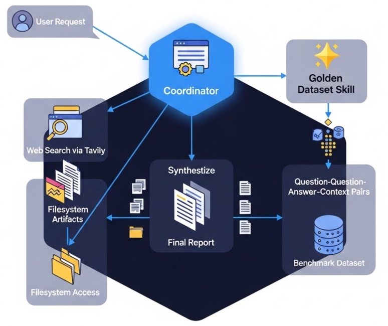
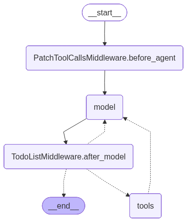

# 🚀 Deep Research

## 🚀 Quickstart

**Prerequisites**: Install [uv](https://docs.astral.sh/uv/) package manager:

```bash
curl -LsSf https://astral.sh/uv/install.sh | sh
```

*Alternative installation for restricted corporate environments:*
```bash
pip install uv
```

Ensure you are in the `deep_research` directory:

```bash
cd deep_research
```

Install packages:

```bash
uv sync
```

*(If `uv` is not available on your system, you can use traditional pip: `pip install -r requirements.txt`)*

Set your API keys in your environment:

```bash
# Option 1: Using Ollama (LOCAL - FREE)
export OLLAMA_API_BASE=http://localhost:11434
export MODEL_NAME=glm-4.7-flash:latest                    # or qwen3.5:latest, deepseek-r1:14b, etc.
export TAVILY_API_KEY=your_tavily_api_key_here            # ✅ Required for web search

# Option 2: Using Cloud APIs
export ANTHROPIC_API_KEY=your_anthropic_api_key_here      # For Claude model
export GOOGLE_API_KEY=your_google_api_key_here            # For Gemini model ([get one here](https://ai.google.dev/gemini-api/docs))
export TAVILY_API_KEY=your_tavily_api_key_here            # Required for web search ([get one here](https://www.tavily.com/)) with a generous free tier
export LANGCHAIN_TRACING_V2=true                          # Enable LangSmith tracing
export LANGSMITH_ENDPOINT=https://api.smith.langchain.com # LangSmith endpoint
export LANGCHAIN_API_KEY=your_langsmith_api_key_here      # [LangSmith API key](https://smith.langchain.com/settings) (free to sign up)
export LANGCHAIN_PROJECT=deep-research-deepagents         # The project name to log traces to
```

## Usage Options

You can run this example in two ways:

### Option 1: Command Line Script

Run the standalone Python script to execute the research agent:

```bash
uv run python research_agent_cli.py "Research AI Agents"
```

#### Command Line Options

The CLI supports the following options:

```
positional arguments:
  subject               Research subject. If omitted, a subject file may be used instead.

optional arguments:
  --subject-file SUBJECT_FILE
                        Optional file path to read the research subject from
  --verify_ssl [VERIFY_SSL]
                        Verify SSL certificates (default: True). Set to False to skip SSL verification
  --ssl-ca-files SSL_CA_FILES
                        Path to a PEM CA bundle to use for HTTPS verification
  --verbose [VERBOSE]   Show progress (default: True). When False, runs agent without progress display
  --help, -h            Show this help message and exit
  --doc-folder DOC_FOLDER
                        Optional folder containing supported documents to use as research material
  --no-web              Disable web search (Tavily) during research
  --target {list,slides,interview,golden-dataset}
                        Optional structured output target. Use '--target list' to see all options.
  --title TITLE         Optional research title for output file
```

#### Examples

Basic research task:
```bash
uv run python research_agent_cli.py "Research AI Agents"
```

With document folder and structured output:
```bash
uv run python research_agent_cli.py "Research AI Agents" --doc-folder ./docs --target study-slides
```

Generate an interview question kit:
```bash
uv run python research_agent_cli.py "Research AI Agents" --doc-folder ./docs --target interview
```

Prepare a comprehensive interview with questions and answers:
```bash
uv run python research_agent_cli.py "Preparing a 60 minutes interview with list of question and answer" --doc-folder ./docs/interview_prep --target interview-coach-pro
```

Generate a golden dataset:
```bash
uv run python research_agent_cli.py "Generate 20 question-answer pairs for the documents provided" --doc-folder ./docs/policy/ --target golden-dataset
```



1. **Context Injection**: A curated set of "Source-of-Truth" documents (PDFs, Markdown, or technical specs) is provided to the agent's filesystem.
2. **Synthesis-First Approach**: The agent is instructed to use the Knowledge Retrieval tool (searching the local filesystem) as its primary source.
3. **Golden Dataset Skill (The Auditor)**:
   - **Question Generation**: It analyzes the provided documents to identify key technical facts, contradictions, or complex logic. 
   - **Context Pinpointing**: It maps the generated question directly to the specific paragraph or page in the local document. 
   - **Answer Extraction**: It generates the "Ideal Answer" based strictly on that local context.
4. **Tavily as a Fallback (Optional)**: Global search is treated as an exception—only triggered if the provided documents are explicitly incomplete, and usually flagged as "out-of-distribution" for the golden set.

Generate code using code-generator skill:
```bash
uv run python research_agent_cli.py --subject-file ./input/coding-create-a-image.txt --target code-generator
```

Without web search (using only local documents):
```bash
uv run python research_agent_cli.py "Research AI Agents" --doc-folder ./docs --no-web
```

Read subject from a file:
```bash
uv run python research_agent_cli.py --subject-file ./input/interview-subject.txt --doc-folder ./docs
```

Show available structured output targets:
```bash
uv run python research_agent_cli.py --target list
```

Structured targets are skill-driven. Add a new `research_agent/skills/<target>/SKILL.md`
with frontmatter, instructions, a JSON Schema block, and a render template to make a new
target available through `--target` without changing core CLI or tool wiring.

If you prefer an interactive notebook, you can still run it via:
```bash
uv run jupyter notebook research_agent.ipynb
```

### Option 2: LangGraph Server

Run a local [LangGraph server](https://langchain-ai.github.io/langgraph/tutorials/langgraph-platform/local-server/) with a web interface:

```bash
langgraph dev
```

LangGraph server will open a new browser window with the Studio interface, which you can submit your search query to:


You can also connect the LangGraph server to a [UI specifically designed for deepagents](https://github.com/langchain-ai/deep-agents-ui):

```bash
git clone https://github.com/langchain-ai/deep-agents-ui.git
cd deep-agents-ui

# Install yarn
npm install -g yarn
npm config set "bin-links" true
# Add %AppData%\npm to PATH for Windows

# For corporation network
yarn config set "strict-ssl" false
# Get configuration from npm config list
yarn config set registry <url>

yarn install
yarn dev
```

Then follow the instructions in the [deep-agents-ui README](https://github.com/langchain-ai/deep-agents-ui?tab=readme-ov-file#connecting-to-a-langgraph-server) to connect the UI to the running LangGraph server. Get the Deployment URL and Assistant ID from the terminal output and langgraph.json file, respectively:

- **Deployment URL**: http://127.0.1:2024
- **Assistant ID**: research

**Open Deep Agents UI** at [http://localhost:3000](http://localhost:3000) and input the Deployment URL and Assistant ID:

- **Deployment URL**: The URL for the LangGraph deployment you are connecting to
- **Assistant ID**: The ID of the assistant or agent you want to use
- [Optional] **LangSmith API Key**: Your LangSmith API key (format: `lsv2_pt_...`). This may be required for accessing deployed LangGraph applications. You can also provide this via the `NEXT_PUBLIC_LANGSMITH_API_KEY` environment variable.

This provides a user-friendly chat interface and visualization of files in state.


Example:
```text
Generate 20 pair of question and answer using the `golden-dataset` skill for the documents provided in this folder '.\docs\policy\'.
```
```text
Give me an overview of AI Evaluation through Harness Engineering
```

## 🧩 Deep Research Agent Components

What is used in the deep research agent?



### 1. Planning (`write_todos`)
- **Workflow Orchestration**: The research workflow starts with creating a todo list using the `write_todos` tool to break down the user's research request into focused tasks.
- **Progress Tracking**: This list is used for task breakdown and ensures systematic research coverage.

### 2. Filesystem & Context Gathering
- **Document Reading**: A specialized `read_doc_folder` tool is used to extract text from various document formats, including:
  - PDF (`.pdf`)
  - Word (`.docx`)
  - PowerPoint (`.pptx`)
  - Excel (`.xlsx`)
  - Text and Markdown (`.txt`, `.md`)
- **Caching**: Extracted text from documents is cached under the active output folder (for example `output/` or `output/<doc-folder-name>/`) to avoid redundant processing.
- **Storage**: Findings and final reports are saved to files like `/research_request.md` and `/final_report.md` (using `write_file`).

### 3. Web Research Tools
- **Tavily Search**: The primary tool for web research is `tavily_search`, which performs web searches to gather information.
- **Webpage Fetching**: `fetch_webpage_content` is used to retrieve and process content from specific URLs found during searches.

### 4. Sub-Agents & Delegation
- **Delegation Strategy**: The orchestrator uses the `task()` tool (provided by the `deepagents` framework) to delegate specific research tasks to specialized sub-agents.
- **Parallel Execution**: Sub-agents can run in parallel for comparison tasks or multi-faceted research (configured in `agent.py`).
- **Context Isolation**: Each sub-agent operates within its own context, and findings are later synthesized by the orchestrator.

### 5. Smart Defaults & Prompting
- **Structured Prompts**: Extensive prompt templates in `research_agent/prompts.py` (e.g., `RESEARCH_WORKFLOW_INSTRUCTIONS`, `RESEARCHER_INSTRUCTIONS`) define detailed behaviors for:
  - Research planning and limits
  - Citation formatting (`[1]`, `[2]`...)
  - Report writing patterns (Comparisons, Lists, Summaries)
  - Tool usage rules (e.g., must use `think_tool` after each search)

### 6. Structured Output Targets
- **Target Skills**: The agent can generate structured data using skills like `golden-dataset`.
- **Validation and Finalization**: Tools like `render_target_output`, `finalize_golden_dataset_output`, and `trigger_dataset_evaluation` are used to validate schemas, export CSVs, and run or re-run quality metrics.

### 7. Context Management
- **Reflection**: The `think_tool` is used for "inner monologue" and strategic planning, helping the agent reflect on findings before deciding the next step.
- **Synthesis**: The orchestrator is responsible for consolidating findings and citations from all sub-agents into a final, coherent report.
- **Auto-summarization**: The underlying `deepagents` framework likely handles conversation pruning or summarization when context limits are reached.

## 📚 Resources

- **[Deep Research Course](https://academy.langchain.com/courses/deep-research-with-langgraph)** - Full course on deep research with LangGraph

### Custom Model

By default, `deepagents` uses `"claude-sonnet-4-5-20250929"`. You can customize this by passing any [LangChain model object](https://python.langchain.com/docs/integrations/chat/). See the Deep Agents package [README](https://github.com/langchain-ai/deepagents?tab=readme-ov-file#model) for more details.

```python
import os
from langchain.chat_models import init_chat_model
from deepagents import create_deep_agent

# Using Ollama (Local)
model = init_chat_model(model=f"ollama:{os.getenv("MODEL_NAME")}", base_url=os.getenv("OLLAMA_API_BASE"))

# Using Claude
model = init_chat_model(model=os.getenv("MODEL_NAME"), temperature = 0.0)

# Using Gemini
from langchain_google_genai import ChatGoogleGenerativeAI

model = ChatGoogleGenerativeAI(model=os.getenv("MODEL_NAME"))

# Using AzureOpenAI
from langchain_openai import AzureChatOpenAI
from pydantic import SecretStr

model = AzureChatOpenAI(
    azure_endpoint=os.getenv("AZURE_OPENAI_ENDPOINT"),
    azure_deployment=os.getenv("AZURE_OPENAI_DEPLOYMENT"),
    api_version=os.getenv("AZURE_OPENAI_API_VERSION"),
    api_key=SecretStr(os.getenv("AZURE_OPENAI_API_KEY", ""))
)

agent = create_deep_agent(
    model=model,
)
```

### Custom Instructions

The deep research agent uses custom instructions defined in `research_agent/prompts.py` that complement (rather than duplicate) the default middleware instructions. You can modify these in any way you want.

| Instruction Set | Purpose |
|----------------|---------|
| `RESEARCH_WORKFLOW_INSTRUCTIONS` | Defines the 5-step research workflow: save request → plan with TODOs → delegate to sub-agents → synthesize → respond. Includes research-specific planning guidelines like batching similar tasks and scaling rules for different query types. |
| `SUBAGENT_DELEGATION_INSTRUCTIONS` | Provides concrete delegation strategies with examples: simple queries use 1 sub-agent, comparisons use 1 per element, multi-faceted research uses 1 per aspect. Sets limits on parallel execution (max 3 concurrent) and iteration rounds (max 3). |
| `RESEARCHER_INSTRUCTIONS` | Guides individual research sub-agents to conduct focused web searches. Includes hard limits (2-3 searches for simple queries, max 5 for complex), emphasizes using `think_tool` after each search for strategic reflection, and defines stopping criteria. |

### Custom Tools

The deep research agent adds the following custom tools beyond the built-in deepagent tools. You can also use your own tools, including via MCP servers. See the Deep Agents package [README](https://github.com/langchain-ai/deepagents?tab=readme-ov-file#mcp) for more details.

| Tool Name | Description |
|-----------|-------------|
| `tavily_search` | Web search tool that uses Tavily purely as a URL discovery engine. Performs searches using Tavily API to find relevant URLs, fetches full webpage content via HTTP with proper User-Agent headers (avoiding 403 errors), converts HTML to markdown, and returns the complete content without summarization to preserve all information for the agent's analysis. Works with both Claude and Gemini models. |
| `think_tool` | Strategic reflection mechanism that helps the agent pause and assess progress between searches, analyze findings, identify gaps, and plan next steps. |
| `read_doc_folder` | Extracts text content from supported local files in a specified folder. Supports `.pdf`, `.txt`, `.md`, `.docx`, `.pptx`, and `.xlsx`. |
| `render_target_output` | Generic target renderer that loads a target skill from `research_agent/skills/*/SKILL.md`, validates the provided JSON payload against that target's schema, and renders the final Markdown output. |
| `finalize_golden_dataset_output` | Golden-dataset only: validates the same JSON as `render_target_output`, exports a CSV under `output/` via `skills/golden_dataset/pipeline.py`, then runs quality metrics so export and evaluation always happen in order. |
| `trigger_dataset_evaluation` | Evaluates an existing golden dataset CSV (or use after export); computes quality metrics using the bundled script. Prefer `finalize_golden_dataset_output` for new datasets. |
